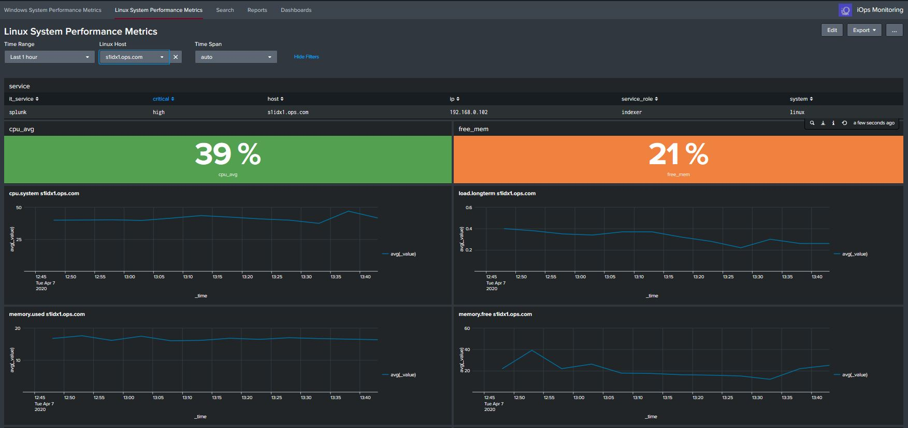

iOpsmon System Monitoring

This apps provides basic Linux and Windows Server Monitoring using metrics in Splunk

The App allows you to monitor Linux and Windows System using metrics. It further provides information on the service and some inventory information. Its best suited to smaller enviroemnts where you want to monitor a small number of services. So say all your critical services as a staring point.

For this app, I have set the polling for every 5 minutes and based it on averages, this is best and most optimised way of getting some metric data in quickly, and viewing the data. Do you really need every second for eveyr metric!..for software developers perhaps yes, but not for admins and service health checks.

The Metrics I'm collecting are as follows, and based on average values only, this will enable you to determine the servers health very quickly, you can later change the metrics and polling times, but this is to get you started quickly.

- CPU – It is crucial to monitor CPU, as it can reach a high utilization.
- Load – This specifies whether the CPU is being used, how much is being executed, and how long   it has been running.
- Disk Capacity and IO – Disk capacity is especially important when it comes to file servers, data bases, Splunk servers, it can directly affect system OS and corrupt the operating system, or cause extreme IO slowness.
- Network – It's extremely important to monitor network performance as input and output of data packets. With network performance, you can measure the utilization of the card and see whats taking up lots o bandwidth
- Memory – Memory is used by many applications and is a key componenet for the proper function of providing services
- Swap Memory – This is virtual memory created by the system and allocated to disk to be used when necessary. Its high utilization can indicate that the amount of memory for the server is     insufficient.

Metrics:

Linux Metrics
- cpu.system
- load.longterm
- memory.used
- memory.free
- df.free
- disk.io
- interface.packets.rx
- interface.packets.tx
- processmon.cpu.percent

Windows Metrics
- Processor Time
- Processor Queue Length
- Available MBytes
- Processes
- Free Space
- Available MBytes
- Pages/sec
- Bytes Total/sec

Application Features:

- Collects metrics with out using collectd (uses the Windows TA and Linux Metrics TA)
- Uses metrics indexes - optimsed for metric data
- Uses the Analytics Workspace (Only available with Splunk 7.1 +) - So Upgrade!
- Uses Compute_Inventory data model for basic Inventory (optional)
- Add service level informaition to host metric dashboard, which provides context

Data Config:
- Metric Data
- data kept for 14 days
- index=linux_metric
- index=windows_metric
- index size = 500MB

Script for Data:-

Dependecies:
The app uses the TA-linux-metrics app, https://splunkbase.splunk.com/app/4856/ this uses a number of shell scripts, yes good old shell scripts....this collects the metric data and sends them to the metrics index linux_metric. You dont need collectd or any thirdparty tool, just deploy the TA-linux-metrics app to the target servers running the UF.

This app requires the Windows TA app https://splunkbase.splunk.com/app/742/ - uses uses perfmon counters which send data to the windows metric index

Requirements:
- Splunk 7.1 + (Metrics Workspace)
- TA-linux-metrics
- Windows TA
- Metrics Indexes

Versions
- Splunk = 8.01
- Windows TA = Version 8.0 - https://splunkbase.splunk.com/app/4856/
- Linux Metrics TA - Version 1.0.3  - https://splunkbase.splunk.com/app/742/ 
- CIM = 4.15 - https://splunkbase.splunk.com/app/1621/  

Install:

This app should be installed only on a Search Head, or All in one Splunk instance, the indexes.conf file needs to be deployed to the indexing layer or all in one server and the TA-linux-metrics and Windows TA's needs to be deployed to the target Linux and Windows servers.

This app was only tested on Splunk on Linux

Download the zip and extract the file, copy the DC_iops_monitoring folder to the Splunk Server
sudo cp -R DC_iops_monitoring /opt/splunk/etc/apps
sudo chown -R splunk:splunk /opt/splunk/etc/apps
sudo -u splunk /opt/splunk/bin/splunk restart

Install the TA-linux-metrics to the UF (Configure the polling or  use the Deployment server for multiple server deployment)

Install the Windows TA to the UF (Configure the polling or  use the Deployment server for multiple server deployment)

Config:

The polling can be adjusted in the inputs.conf in the TA-linux-metrics, the data will be sent to index=linux_metric, this can be changed if required.

You will need to run chmod +x for the shell scripts to run in /bin  

Edit the iops_services.csv and create the services

Example - Add the below assets to the csv file - base this on your enviroment
- it_service,host,system,ip,service_role,critical
- splunk,s1hf1.ops.com,linux,192.168.0.109,heavy_forwarder,medium
- ad,DC2,windows,192.168.0.1,ad_server,high

NOTE:Please note the host names in the metrics dashboard drop down mush match the host name in the csv file

Data model - optional
Accelerate the Compute_Inventory and add the index's that store the CIM complaint data for Linux and Windows servers, the TA's required for these are listed below (These are NOT the metrics indexes), these require considerations for the indexes and collects

- https://splunkbase.splunk.com/app/4856/ (Windows TA - this is the same TA as mentioned before)
- https://splunkbase.splunk.com/app/833/  (Unix/Linux TA - this is not the metrics TA)

If dont have the Unix/Linux TA and configure the other OS indexes for non metric data, you will not get the basic inventory data.

Use:
Login to Splunk and go DC_linux_monitoring app and select dashboards, select the host and you should see the you should see data, this is providing you have installed the TA's and data is being collected and ingested correctly.
