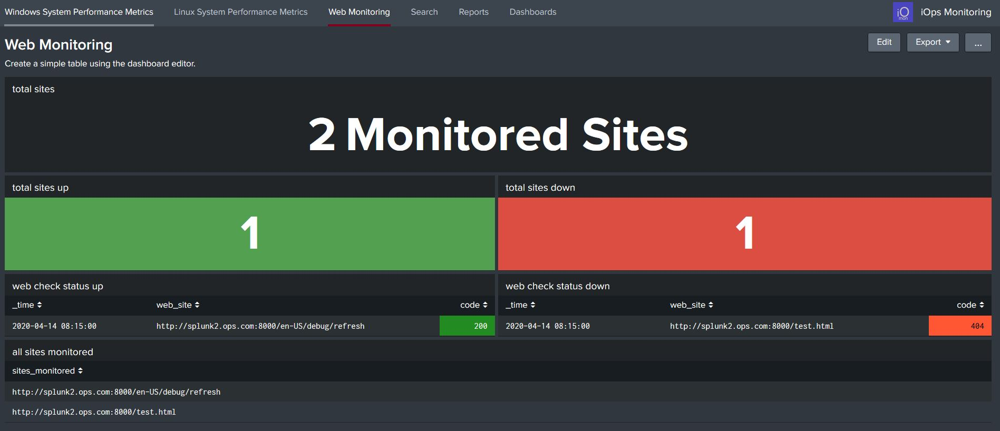
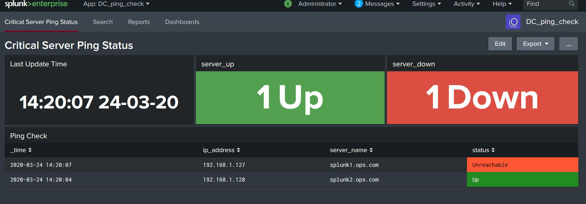

iOpsmon Monitoring

This apps provides basic Linux and Windows systems performance monitoring, web site, hearbeat checks and service information.

The App allows you to monitor Linux and Windows System using metrics. It further provides information on the service and some inventory information. Its best suited to smaller environment  where you want to monitor a small number of services. So say all your critical services as a staring point.

The app will give you what service the system being monitored belongs to, so this could be a web server, email, proxy etc, this helps identify if the system is part of a critical service or not.

For this app, I have set the performance polling for every 5 minutes and based it on averages, this is best and most optimised way of getting some metric data in quickly, and viewing the data. Do you really need every second for eveyr metric!..for software developers perhaps yes, but not for admins and service health checks.

Application Features:

- Collects metrics with out using collectd (uses the Windows TA and Linux Metrics TA)
- Uses metrics indexes - optimsed for metric data
- Uses the Analytics Workspace (Only available with Splunk 7.1 +) - So Upgrade!
- Uses Compute_Inventory data model for basic Inventory (optional)
- Add service level information to host metric dashboard, which provides context
- Monitors URLS - basic up / down status
- Monitors Critical servers - Ping check

Metrics Overview:

The Metrics I'm collecting are as follows, and based on average values only, this will enable you to determine the servers health very quickly, you can later change the metrics and polling times, but this is to get you started quickly.

- CPU – It is crucial to monitor CPU, as it can reach a high utilization.
- Load – This specifies whether the CPU is being used, how much is being executed, and how long   it has been running.
- Disk Capacity and IO – Disk capacity is especially important when it comes to file servers, data bases, Splunk servers, it can directly affect system OS and corrupt the operating system, or cause extreme IO slowness.
- Network – It's extremely important to monitor network performance as input and output of data packets. With network performance, you can measure the utilization of the card and see whats taking up lots o bandwidth
- Memory – Memory is used by many applications and is a key componenet for the proper function of providing services
- Swap Memory – This is virtual memory created by the system and allocated to disk to be used when necessary. Its high utilization can indicate that the amount of memory for the server is     insufficient.

Metrics:

Linux Metrics

- cpu.system
- load.longterm
- memory.used
- memory.free
- df.free
- disk.io
- interface.packets.rx
- interface.packets.tx
- processmon.cpu.percent

Windows Metrics

- Processor Time
- Processor Queue Length
- Available MBytes
- Processes
- Free Space
- Available MBytes
- Pages/sec
- Bytes Total/sec

Web Site Monitoring

You can add a some web sites to the configuration and the app will poll every 5 minutes for an up down status. just add the URL, such as http:test.com/test.html and in 5 minutes you should see data coming through

Critical Server Hearbeat Check:

YOu can add critical servers to a list and the app will run regular ping checks to check for an updown status. 

Data Config:

- Metric Data
- data kept for 14 days
- index=linux_metric
- index=windows_metric
- index size = 500MB

Web Monitoring Data:

- data kept for 14 days
- index=webmon
- sourcetype=webmon:log  
- index size = 500MB

Ping  Monitoring Data:

- data kept for 14 days
- index=ping
- sourcetype=ping:csv  
- index size = 100MB

App Dependecies:
The app uses the TA-linux-metrics app, https://splunkbase.splunk.com/app/4856/ this uses a number of shell scripts, yes good old shell scripts....this collects the metric data and sends them to the metrics index linux_metric. You dont need collectd or any thirdparty tool, just deploy the TA-linux-metrics app to the target servers running the UF.

This app requires the Windows TA app https://splunkbase.splunk.com/app/742/ - uses uses perfmon counters which send data to the windows metric index

Optionally if you download the CIM and enable the Compute_Inventory data model, the app will show some inventory level information

Requirements:

- Universal Forwarder Agents - https://www.splunk.com/en_us/download/splunk-enterprise.html
- Splunk 7.1 + (Metrics Workspace)
- TA-linux-metrics
- Windows TA
- Metrics Indexes
- Python 3 (Comes with Splunk 8.x )

Versions Used:

- Splunk = 8.01
- Windows TA = Version 8.0 - https://splunkbase.splunk.com/app/4856/
- Linux Metrics TA - Version 1.0.3  - https://splunkbase.splunk.com/app/742/ 
- CIM = 4.15 - https://splunkbase.splunk.com/app/1621/  

Indexes config:

- Configure the indexes that are set in the indexes.conf.create file

Install:

This app should be installed only on a Search Head, or All in one Splunk instance, the indexes.conf file needs to be deployed to the indexing layer or all in one server and the TA-linux-metrics and Windows TA's needs to be deployed to the target Linux and Windows servers.

This app was only tested on Splunk on Linux

Download the zip and extract the file, copy the DC_iops_monitoring folder to the Splunk Server
sudo cp -R DC_iops_monitoring /opt/splunk/etc/apps
sudo chown -R splunk:splunk /opt/splunk/etc/apps
sudo -u splunk /opt/splunk/bin/splunk restart

Install the TA-linux-metrics to the UF (Configure the polling or  use the Deployment server for multiple server deployment)

Install the Windows TA to the UF (Configure the polling or  use the Deployment server for multiple server deployment)

Metric Config:

The polling can be adjusted in the inputs.conf in the TA-linux-metrics and Splunk_TA_windows , the data should be sent to index=linux_metric for linux data and index=windows_metric for Windows data, this can be changed if required, but leave as is to get it running.

You will need to run chmod +x for the shell scripts to run in /bin  

Services Config:
Edit the iops_services.csv to create the services info, think about your systems and what service they belong to

Example - Add the below assets to the csv file - base this on your enviroment

- it_service,host,system,ip,service_role,critical
- splunk,s1hf1.ops.com,linux,192.168.0.109,heavy_forwarder,medium
- ad,DC2,windows,192.168.0.1,ad_server,high

NOTE:Please note the host names in the metrics dashboard drop down mush match the host name in the csv file

Data model - optional
Accelerate the Compute_Inventory and add the index's that store the CIM complaint data for Linux and Windows servers, the TA's required for these are listed below (These are NOT the metrics indexes), these require considerations for the indexes and collects

- https://splunkbase.splunk.com/app/4856/ (Windows TA - this is the same TA as mentioned before)
- https://splunkbase.splunk.com/app/833/  (Unix/Linux TA - this is not the metrics TA)

If dont have the Unix/Linux TA and configure the other OS indexes for non metric data, you will not get the basic inventory data.

Web Site Monitoring Config:

Add the urls you want to monitor, start with a few to get it working.
Edit the /opt/splunk/etc/apps/DC_iops_monitoring/bin/scripts/url.conf file

You can change the polling time in the inputs.conf, leave as default intially (5mins).

Ping Check Monitoring Config:

Add the servers to the /opt/splunk/etc/apps/DC_iops_monitoring/lookups/servers.csv file

You can change the polling time in the inputs.conf, leave as default intially (5mins).

Use:
Login to Splunk and go DC_linux_monitoring app and select dashboards, select the host and you should see the you should see data, this is providing you have installed the TA's and data is being collected and ingested correctly.

Logs:
To clear the web logs - set the below to run in cron daily 
find /opt/splunk/etc/apps/DC_iops_monitoring/bin/scripts/logs/ -name "*_status.log" -type f -mtime +2 -delete

Issues:

- Ensure the app has the splunk user permissions
- Ensure the scripts under the bin folder change run - chmod +x
- Ensure you have deployed and configured the Windows and Linux TA's to collect the metric data and set the correct indexes - see the file called indexes.conf.create

Support:
None - This is a free app that I developed for my own purpose, but it's great if you want to use Splunk for free, so if you want to use it, test it in a develpoment enviroment first

This App has not been tested on Windows Splunk platform
